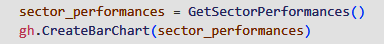
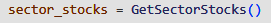
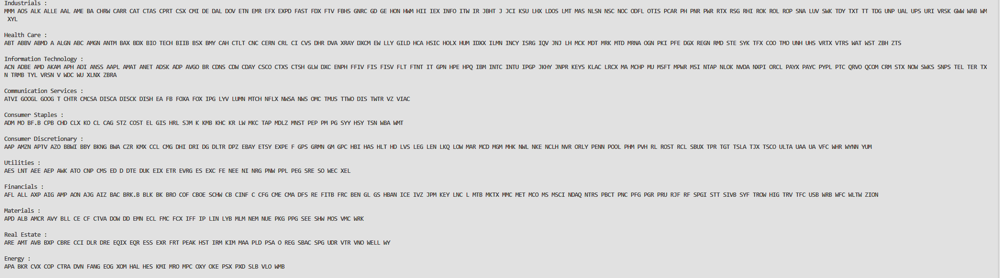
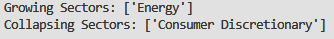
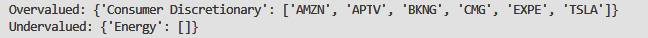

# **Sector Analysis Project By Rohit Tripathy**

## **Overview of the Project**

This program aims to find **overvalued** S&P 500 equities in **under-performing sectors**, and **undervalued** S&P 500 equities in **over-performing sectors**.  
- **The Process**
      
    - First, I categorize each of the equities in the S&P 500 into one of these 11 sectors: 
        |                        |                         |             |                        |   |
        |-------                 |------                   |------       |------                  |---|
        | Materials              | Communication Services  | Financials  | Consumer Discretionary |   |
        | Information Technology | Industrials             | Real Estate | Consumer Staples       |   |
        | Utilities              | Health Care             | Energy      |                        |   |
      
    - Next, I determine which sectors are over-performing and under-performing.
        - An over-performing sector has a YTD growth greater than 0 percent.
        - An under-performing sector has a YTD growth less than 0 percent.
      
    - With this information, I look for undervalued equities within the over-performing sectors, as well as overvalued equities within the under-performing sectors.

---

## **Determining Overvalued and Undervalued Equities**

- **The P/E Ratio**
  - The metric that I use to valuate an equity is it's Price-to-Earnings ratio, commonly known as the P/E ratio. 
  - A low P/E Ratio signifies that an equity is probably undervalued, while a high P/E Ratio signifies that the equity is probably overvalued.
  - In order to classify a P/E Ratio as high or low, however, we must compare the P/E ratios of similar equities. In other words, we need to look at the P/E ratios of equities within the same sector to determine if a specific equity has an unusually high or low P/E ratio.
  

- **Outliers**
  - By gathering the P/E Ratios of all equities within a certain sector, it is possible to determine unusally high or low values by constructing a simple Box-and-Whisker plot.
    - The unusually high values would be the outliers that are on the right hand size of the plot.
    - The unusually low values would be the outliers that are on the left hand side of the plot.
  

---

## **Quick Overview of the Script**

  - The **GetSectorPerformances()** method returns a dictionary where the keys are the names of the different sectors, and the associated value is their YTD growth expressed as a decimal. 
    - 
  - The **CreateBarChart()** method takes in a dictionary, and displays a bar chart, where the X-axis is the sectors, and the Y-axis is the YTD Growth. 
    - 
  

  - The **GetSectorStocks()** categorizes each equity in the S&P 500 in one of the 11 sectors mentioned in the project overview.
    - 
  

  - The **EvaluateSectors()** method takes in the sector performances dictionary from above, as well as some integer n. With this information, the method returns the top n over-performing sectors, and top n under-performing sectors.
    - 
  

  - The **EvaluateStocks()** method takes in the list of over-performing and under-performing sectors, as well as the names of the equities associated with those sectors. With this, the method will return overvalued equities in the under-performing sectors, as well as the undervalued equities in the over-performing sectors.
    -   
- In addition, the **CreateBoxPlot()** method is called within this method. The CreateBoxPlot() method displays a Box-and-Whisker plot of each equities P/E Ratio within a certain sector. This is so that you can visually see if there a equities with unusual P/E Ratios.
    - Since the Energy Sector was determined to be an **over-performing** sector, we are looking for **undervalued** equities, meaning that we are looking for outliers on the **left** side. By looking at the box plot below, there seems no undervalued equities within this sector.
    -  
    - Since the Consumer Discretionary Sector was determined to be an **under-performing** sector, we are looking for **overvalued** equities, meaning that we are looking for outliers on the **right** side. By looking at the box plot below, there seems to be 6 overvalued equities within this sector.
    -  
    

